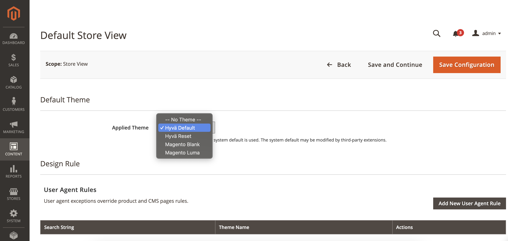
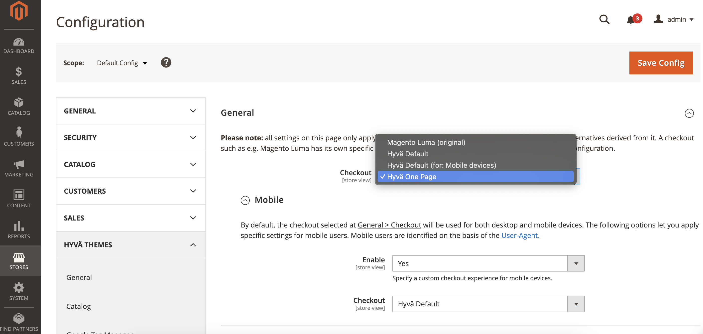

# AltaPay for Hyvä Checkout

AltaPay, headquartered in Denmark, is an internationally focused fintech company within payments with the mission to make payments less complicated. We help our merchants grow and expand their business across payment channels by offering a fully integrated seamless omni-channel experience for online, mobile and instore payments, creating transparency and reducing the need for manual tasks with one centralized payment platform.

AltaPay’s platform automizes, simplifies, and protects the transaction flow for shop owners and global retail and e-commerce companies, supporting and integrating smoothly into the major ERP systems. AltaPay performs as a Payment Service Provider operating under The Payment Card Industry Data Security Standard (PCI DSS).

## Prerequisites
This module relies on the following components:
- [AltaPay Module](https://github.com/AltaPay/plugin-magento2-community)
- Hyvä default theme
- Hyva checkout plugin

## Installation
Follow these steps to install and configure AltaPay for Hyvä Checkout in your Magento store:

1. Run the following command in the Magento 2 root folder to install the module:
```bash
composer require altapay/magento2-hyva-checkout
``` 
2. Enable the module:
```bash
php bin/magento module:enable Altapay_HyvaCheckout
``` 
3. Upgrade the setup:
```bash
php bin/magento setup:upgrade
```
4. Generate Hyvä configuration:
```bash
php bin/magento hyva:config:generate
```
5. Build Tailwind CSS for Hyvä themes:
```bash
npm --prefix vendor/hyva-themes/magento2-default-theme/web/tailwind/ run ci
npm --prefix vendor/hyva-themes/magento2-default-theme/web/tailwind/ run build-prod
```
Or from your custom theme:
```bash
npm --prefix app/design/frontend/<Vendor>/<Theme>/web/tailwind run ci
npm --prefix app/design/frontend/<Vendor>/<Theme>/web/tailwind run build-prod
```

## Configuration

The setup process requires configuring AltaPay Payment. This module does not introduce any custom configuration options. Instead, the AltaPay Payment configuration follows the standard setup process, similar to any default scenario (e.g., Luma-based checkout).

For detailed configuration instructions, please review the following link:
[AltaPay Magento 2 Community Plugin - Configuration Guide](https://github.com/AltaPay/plugin-magento2-community/wiki)

Next, the setup requires configuring the Hyvä theme and Hyvä checkout for the specified store.

- Go to **Content > Design > Configuration** in the admin panel and set the **Hyvä/default** theme for the desired store view.

  

- Navigate to **Stores > Configuration > Hyvä Themes > Checkout > General**, then enable **Hyvä Default** (or **Hyvä One Page**) for the selected store view.

  
